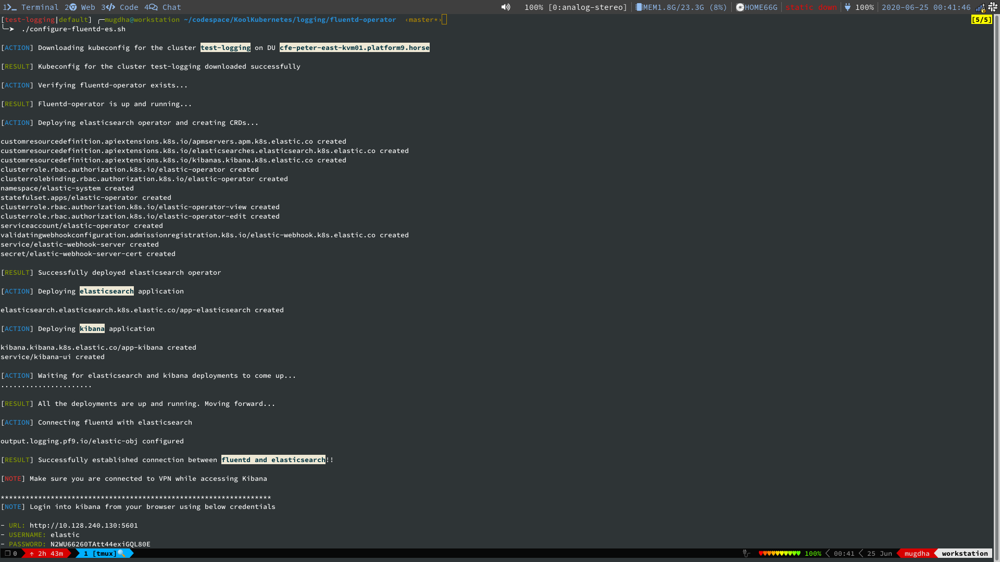
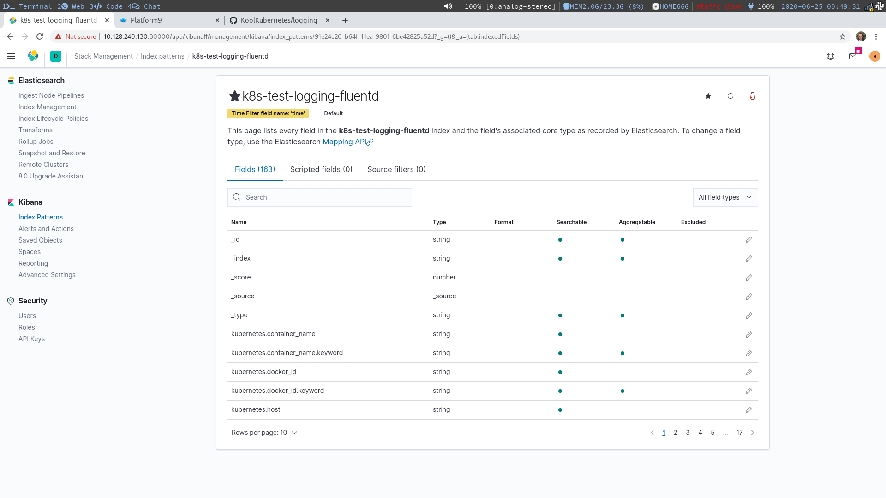
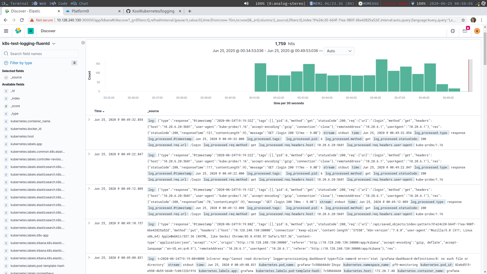

# fluentd-operator

### Log pipeline management for Kubernetes ###
Logging operator provides Kubernetes native log management for developers and devops teams. Main benefits are:

* Configure logging using Kubernetes constructs. No need to learn log configurations.
* Flexibility and Reuse through Kubernetes Custom Resource Definitions.
* Handles logging service deployment and scaling.
* Support for popular datastores like ElasticSearch, S3 and Loki.

### Understanding ###
Logging operator uses fluent-bit and fluentd for collection and processing of logs respectively. The fluent-bit component is deployed as daemonset that performs log formatting and filtering. Fluentd is used as aggregator and buffer which ships logs to chosen datastore. 

**Output** is a Custom Resource Definition that defines a datastore where logs are to be stored. Currently, the operator supports ElasticSearch, S3 and Loki as log stores.

## Logging on PMK Cluster ###
If you are using a PMK provisioned cluster, fluentd-operator can be automatically enabled on the cluster by adding `pf9-system:logging` tag in the UI during cluster creation.

For deploying elasticsearch datastore, configuring with fluentd-operator and viewing the logs in Kibana, simply run the below script

```
./configure-fluentd-es.sh 
```

This script deploys ECK (Elastic Cloud on Kubernetes) along with elasticsearch and kibana deployments. It also creates the `Output` Custom Resource pointing to the elasticsearch deployment and automatically forwarding logs to Kibana.

**Notes:**
1. Make sure to set the below mentioned variables prior to running the script  
    ` $DU_FQDN | $DU_USERNAME | $DU_PASSWORD | $DU_TENANT | $DU_CLUSTER `

2. Appropriate **Storage Class** should be created for your cluster and set to default. You can create a Storage Class from Platform9 UI.

3. The PMK cluster should be accessible using Floating IP or Metallb should be configured.

4. You should be connected to Platform9 VPN while running the script for configuring kubectl with your PMK Cluster.

Here is a sample screenshot of `configure-fluentd-es.sh` script. At the end of the script you can see the Kibana login details. Use them to login into kibana from your brower while you are connected to VPN.




Finally you can check the index configured by fluentd-operator getting created in elasticsearch. Logs are available in kibana after creating an index-pattern.

Attached below are the screenshots of the Kibana UI configured with elasticsearch and fluentd-operator. You can see an index named `k8s-test-logging-fluentd` is created in elasticsearch. You can now create an index-pattern for an index in Kibana and view the logs in the *Discover* tab.





### Installing Operator (manually) ###
If operator is not already installed, you can install and configure it with with the script provided in fluentd-operator repository
```
github.com/platform9/fluentd-operator/hack/deploy.sh
```

#### Configure datastore ####
The below example shows how to forward logs to an object storage like elasticsearch.

Create output CR indicating elasticsearch as destination. Note that elasticsearch should be deployed in the same cluster.
```yaml
apiVersion: logging.pf9.io/v1alpha1
kind: Output
metadata:
  name: objstore
spec:
  type: elasticsearch
  params:
    - name: url
      value: <ELASTIC_SERVICE_FQDN>
    - name: user
      value: <ELASTIC_USERNAME>
    - name: password
      value: <ELASTIC_PASSWORD>
    - name: index_name
      value: <INDEX_NAME_IN_ELASTIC>
```
