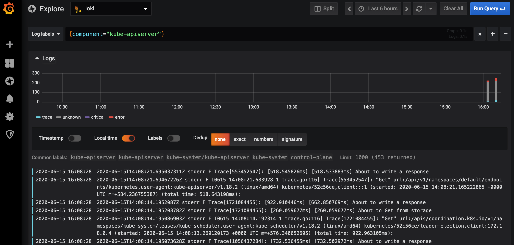

# Setting up multi-cluster logging

This guide provides a step-by-step overview of how to deploy a logging 
infrastructure on multiple Kubernetes clusters and how to connect them together.

The architecture of this multi-cluster infrastructure can be arbitrary, but we
assume an architecture similar to that promoted by Cluster API: there is a 
_management cluster_ responsible for managing multiple _workload clusters_.

For our logging infrastructure this means that we want to collect logs of the 
pods in the workload clusters, and send them to the management cluster for 
aggregation and visualization. 

## Prerequisites 

To follow this guide, you will need to have the following available in your 
current environment:

- [kubectl](https://kubernetes.io/docs/tasks/tools/install-kubectl/)
- [helm](https://helm.sh/docs/intro/install/): we assume the tiller-free helm v3
- [kind](https://kind.sigs.k8s.io/docs/user/quick-start/): to run through this 
  guide with an offline setup. 

This guide has been verified to work with kubectl v1.18.3, kind v0.8.1, and 
helm v3.2.3 on an Ubuntu 18.04 machine.

## Configuring the management cluster

The management cluster is the Kubernetes cluster with the components installed 
which are responsible for the management of the workload clusters. For the 
logging infrastructure this means that in this cluster we want to have the 
aggregate overview of the logs of all workload clusters.

### Setup a new or get access to an existing cluster

To install the logging infrastructure on the management cluster, we will need 
to have and have admin access to the management cluster.

#### Deploy a KinD cluster

The management cluster has public services that need to be exposed using an 
ingress. For that, we expose the ingress NodePorts from the kind containers to
the host itself, using a custom kind cluster configuration:

```
kind create cluster --config mgmt/kind-mgmt-cluster.yaml --name mgmt
kind get kubeconfig --name mgmt > mgmt.kubeconfig
export KUBECONFIG="$(pwd)/mgmt.kubeconfig"
```

#### Use an existing cluster

While this guide assumes that you will use a new KinD cluster, it is also 
possible to use an existing cluster, or a cluster created through another 
provider. 

We assume that the ingress exposes services on ports `30080` (HTTP) and 
`30443` (HTTPS)  on localhost. Depending on your setup you might need to change
parts of the configuration to reflect your cluster configuration. 

### Deploy an ingress provider

To expose the logging-related services on a single IP, we rely on the ingress 
support in Kubernetes. For this we need to deploy the 
[nginx operator](https://github.com/kubernetes/ingress-nginx):

```
kubectl apply -f mgmt/ingress-nginx
```

We apply the config in this repository, because it is configured to work on KinD.
You might need to adjust this config if using another cluster.

Using KinD, to verify that the ingress is functioning properly, you can run the 
following commands:

```
MGMT_IP=$(docker inspect -f '{{range .NetworkSettings.Networks}}{{.IPAddress}}{{end}}' mgmt-control-plane)
curl --head $MGMT_IP:30080
# Expected output:
# HTTP/1.1 404 Not Found
# ...
``` 

### Deploy Loki for the log aggregation

We use [Loki](https://github.com/grafana/loki) to manage the log aggregation. 
Loki is a horizontally-scalable, highly-available, multi-tenant log aggregation 
system, with an architecture similar to that of Prometheus. It is designed to be 
cost-effective and easy to operate. It does not index the contents of the logs, 
but rather a set of labels for each log stream.

To install loki on the cluster use the following helm chart:
```bash
kubectl create namesapce logging
helm install loki mgmt/loki/with-helm/loki --namespace logging --wait
```

We now need to expose Loki over ingress:
```bash
kubectl apply -f mgmt/loki/loki-ingress.yaml
```

Finally, to verify that Loki was setup properly, run the following command:
```bash
curl $MGMT_IP:30080/loki/api/prom/label
# Expected output:
# {}
```

### Deploy Grafana for the log visualization

Loki only takes care of the log aggregation and does not provide a convenient
visualization. Instead, we will use Grafana for the log visualization.

First we add the required configuration for Grafana to use Loki as a datasource:
```bash
kubectl create namespace dashboards
kubectl apply -f mgmt/grafana/grafana-datasource-loki.yaml
``` 

Then, install Grafana using helm:
```bash
helm install grafana mgmt/grafana/with-helm/grafana --namespace dashboards --wait
```

Grafana requires a password, to retrieve it:
```bash
kubectl get secret --namespace dashboards grafana -o jsonpath="{.data.admin-password}" | base64 --decode ; echo
```

Then, expose Grafana locally:
```
kubectl -n dashboards port-forward svc/grafana 3000:80
```

Finally, navigate to `localhost:3000` in your browser. You should see a
configured data source and values in the single configured dashboard.


## Configuring a workload cluster

Now that we have the logging infrastructure setup in the management cluster, we
can configure the log collection on a workload cluster  

### Setup a new or get access to an existing cluster

Similar to the management cluster, we will need a workload cluster to be 
accessible. Here we assume that you will use a kind cluster, though any cluster 
should work:

```
kind create cluster --name workload-1
kind get kubeconfig --name workload-1 > workload-1.kubeconfig
export KUBECONFIG="$(pwd)/workload-1.kubeconfig"
```

### Deploy promtail for log collection

We rely on [promtail](https://github.com/grafana/loki/tree/master/docs/clients/promtail) 
as a workload cluster agent to ship local logs to the Loki deployment on the 
management cluster.

Ensure that the KUBECONFIG is set to point to the workload cluster, and that 
`MGMT_IP` is set to the IP on which the management cluster exposes the Loki 
ingress: 
```
MGMT_IP=$(docker inspect -f '{{range .NetworkSettings.Networks}}{{.IPAddress}}{{end}}' mgmt-control-plane)
kubectl create namespace logging
helm install promtail workload/promtail/with-helm/promtail --wait \
    --namespace logging \
    --set loki.urlOverride=http://$MGMT_IP:30080/loki/api/prom/push 
```

To verify that promtail is functioning correctly, expose the promtail UI locally:
```bash
kubectl --namespace logging port-forward daemonset/promtail 3101
```

Then, navigate to `localhost:3101` in your browser. You should see entries
under the Service Discovery and Targets tabs.

## Viewing the logs

To view, switch to the management cluster, expose Grafana locally again, 
and navigate to `localhost:3000`:
```
export KUBECONFIG=$(pwd)/mgmt.kubeconfig
kubectl -n dashboards port-forward svc/grafana 3000:80
```

As of writing, Grafana does not yet support Loki data in dashboards. However, 
you should now be able to go to "Explore", and select or create a label to 
filter and display the logs. For example to view the logs from the workload 
clusters' apiserver component, use: `{instance="etcd-workload-1-control-plane"}`.



## Clean up setup

If you used kind, to clean up the resources created in this guide, you simply 
need to delete the created clusters:

```bash
kind delete cluster --name workload-1 
kind delete cluster --name mgmt
```
